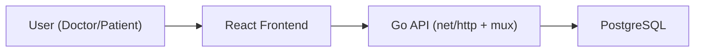

# Architecture

## High-Level Design

## Backend Responsibilities
- `main.go`: router, route registration, CORS, server startup
- `config.go`: environment configuration and runtime defaults
- `users.go`: user registration/login and JWT token generation
- `doctors.go`: doctor slot creation logic
- `patients.go`: doctor selection, slot browsing, reservation lifecycle

## Frontend Responsibilities
- `SignIn` and `SignUp`: authentication forms
- `SchedulePage`: doctor slot management
- `PatientPage`: doctor selection, booking, cancel/update, reservation list
- `config.js`: shared API base URL setup

## Data Model
- `user`: users with role (`doctor` or `patient`)
- `DoctorsSchedule`: doctor availability slots
- `patientAppointment`: booked appointments linked to users and slots

## Runtime Configuration
- Backend settings are loaded from environment variables (`.env`)
- Frontend API base URL is loaded from `REACT_APP_API_BASE_URL`

## Current Architectural Constraints
- Some request flows rely on package-level mutable state in backend handlers.
- Token validation middleware is not yet enforced globally.
- Passwords are currently stored in plain text in DB (development-only pattern; not production-ready).
